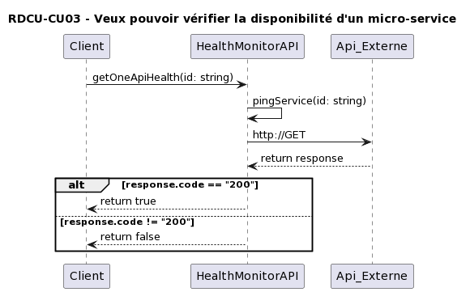

# Documentation de l'architecture du laboratoire de LOG430

- [Documentation de l'architecture du laboratoire de LOG430](#documentation-de-larchitecture-du-laboratoire-de-log430)
- [Page titre](#page-titre)
- [Introduction](#introduction)
- [Scénario d'objectif d'affaire](#scénario-dobjectif-daffaire)
  - [OA-1. Faciliter le recrutement des nouveaux chargés de laboratoire.](#oa-1-faciliter-le-recrutement-des-nouveaux-chargés-de-laboratoire)
  - [OA-2. Validez si le transport par autobus est toujours plus rapide, peu importe l'heure de la journée](#oa-2-validez-si-le-transport-par-autobus-est-toujours-plus-rapide-peu-importe-lheure-de-la-journée)
- [Cas d'utilisations](#cas-dutilisations)
    - [**CU01** - Veux comparer les temps de trajet.](#cu01---veux-comparer-les-temps-de-trajet)
        - [CU01-D1 **Disponibilité**](#cu01-d1-disponibilité)
      - [CU01-M1 **Modifiabilité**](#cu01-m1-modifiabilité)
      - [CU01-P1 **Performance**](#cu01-p1-performance)
      - [CU01-S1 **Sécurité**](#cu01-s1-sécurité)
      - [CU01-T1 **Testabilité**](#cu01-t1-testabilité)
      - [CU01-U1 **Usabilité**](#cu01-u1-usabilité)
      - [CU01-I1 **Interopérabilité**](#cu01-i1-interopérabilité)
    - [**CU02** - Veux pouvoir mettre le chaos dans les microservices.](#cu02---veux-pouvoir-mettre-le-chaos-dans-les-microservices)
      - [CU02-D1 **Disponibilité**](#cu02-d1-disponibilité)
      - [CU02-M1 **Modifiabilité**](#cu02-m1-modifiabilité)
      - [CU02-P1 **Performance**](#cu02-p1-performance)
      - [CU02-S1 **Sécurité**](#cu02-s1-sécurité)
      - [CU02-T1 **Testabilité**](#cu02-t1-testabilité)
      - [CU02-U1 **Usabilité**](#cu02-u1-usabilité)
      - [CU02-I1 **Interopérabilité**](#cu02-i1-interopérabilité)
    - [**CU03** - Veux pouvoir vérifier la disponibilité d'un micro-service](#cu03---veux-pouvoir-vérifier-la-disponibilité-dun-micro-service)
      - [CU03-D1 **Disponibilité**](#cu03-d1-disponibilité)
      - [CU03-M1 **Modifiabilité**](#cu03-m1-modifiabilité)
      - [CU03-P1 **Performance**](#cu03-p1-performance)
      - [CU03-S1 **Sécurité**](#cu03-s1-sécurité)
      - [CU03-T1 **Testabilité**](#cu03-t1-testabilité)
      - [CU03-U1 **Usabilité**](#cu03-u1-usabilité)
      - [CU03-I1 **Interopérabilité**](#cu03-i1-interopérabilité)
    - [**CU04** - veux pouvoir sauvegarder un trajet selon l'utilisateur](#cu04---veux-pouvoir-sauvegarder-un-trajet-selon-lutilisateur)
      - [CU04-D1 **Disponibilité**](#cu04-d1-disponibilité)
      - [CU04-M1 **Modifiabilité**](#cu04-m1-modifiabilité)
      - [CU04-P1 **Performance**](#cu04-p1-performance)
      - [CU04-S1 **Sécurité**](#cu04-s1-sécurité)
      - [CU04-T1 **Testabilité**](#cu04-t1-testabilité)
      - [CU04-U1 **Usabilité**](#cu04-u1-usabilité)
      - [CU04-I1 **Interopérabilité**](#cu04-i1-interopérabilité)
    - [**CU05** - vous devez proposer un nouveau cas d'utilisation](#cu05---vous-devez-proposer-un-nouveau-cas-dutilisation)
      - [CU05-D1 **Disponibilité**](#cu05-d1-disponibilité)
      - [CU05-M1 **Modifiabilité**](#cu05-m1-modifiabilité)
      - [CU05-P1 **Performance**](#cu05-p1-performance)
      - [CU05-S1 **Sécurité**](#cu05-s1-sécurité)
      - [CU05-T1 **Testabilité**](#cu05-t1-testabilité)
      - [CU05-U1 **Usabilité**](#cu05-u1-usabilité)
      - [CU05-I1 **Interopérabilité**](#cu05-i1-interopérabilité)
    - [**CU06** - vous devez proposer un nouveau cas d'utilisation](#cu06---vous-devez-proposer-un-nouveau-cas-dutilisation)
      - [CU06-D1 **Disponibilité**](#cu06-d1-disponibilité)
      - [CU06-M1 **Modifiabilité**](#cu06-m1-modifiabilité)
      - [CU06-P1 **Performance**](#cu06-p1-performance)
      - [CU06-S1 **Sécurité**](#cu06-s1-sécurité)
      - [CU06-T1 **Testabilité**](#cu06-t1-testabilité)
      - [CU06-U1 **Usabilité**](#cu06-u1-usabilité)
      - [CU06-I1 **Interopérabilité**](#cu06-i1-interopérabilité)
    - [**CU07** - vous devez proposer un nouveau cas d'utilisation](#cu07---vous-devez-proposer-un-nouveau-cas-dutilisation)
      - [CU07-D1 **Disponibilité**](#cu07-d1-disponibilité)
      - [CU07-M1 **Modifiabilité**](#cu07-m1-modifiabilité)
      - [CU07-P1 **Performance**](#cu07-p1-performance)
      - [CU07-S1 **Sécurité**](#cu07-s1-sécurité)
      - [CU07-T1 **Testabilité**](#cu07-t1-testabilité)
      - [CU07-U1 **Usabilité**](#cu07-u1-usabilité)
      - [CU07-I1 **Interopérabilité**](#cu07-i1-interopérabilité)
    - [**CU08** - vous devez proposer un nouveau cas d'utilisation](#cu08---vous-devez-proposer-un-nouveau-cas-dutilisation)
      - [CU08-D1 **Disponibilité**](#cu08-d1-disponibilité)
      - [CU08-M1 **Modifiabilité**](#cu08-m1-modifiabilité)
      - [CU08-P1 **Performance**](#cu08-p1-performance)
      - [CU08-S1 **Sécurité**](#cu08-s1-sécurité)
      - [CU08-T1 **Testabilité**](#cu08-t1-testabilité)
      - [CU08-U1 **Usabilité**](#cu08-u1-usabilité)
      - [CU08-I1 **Interopérabilité**](#cu08-i1-interopérabilité)
    - [**CU09** - vous devez proposer un nouveau cas d'utilisation](#cu09---vous-devez-proposer-un-nouveau-cas-dutilisation)
      - [CU09-D1 **Disponibilité**](#cu09-d1-disponibilité)
      - [CU09-M1 **Modifiabilité**](#cu09-m1-modifiabilité)
      - [CU09-P1 **Performance**](#cu09-p1-performance)
      - [CU09-S1 **Sécurité**](#cu09-s1-sécurité)
      - [CU09-T1 **Testabilité**](#cu09-t1-testabilité)
      - [CU09-U1 **Usabilité**](#cu09-u1-usabilité)
      - [CU09-I1 **Interopérabilité**](#cu09-i1-interopérabilité)
    - [**CU10** - vous devez proposer un nouveau cas d'utilisation.](#cu10---vous-devez-proposer-un-nouveau-cas-dutilisation)
      - [CU10-D1 **Disponibilité**](#cu10-d1-disponibilité)
      - [CU10-M1 **Modifiabilité**](#cu10-m1-modifiabilité)
      - [CU10-P1 **Performance**](#cu10-p1-performance)
      - [CU10-S1 **Sécurité**](#cu10-s1-sécurité)
      - [CU10-T1 **Testabilité**](#cu10-t1-testabilité)
      - [CU10-U1 **Usabilité**](#cu10-u1-usabilité)
      - [CU10-I1 **Interopérabilité**](#cu10-i1-interopérabilité)
- [Vue architecturale de contexte](#vue-architecturale-de-contexte)
  - [Présentation primaire](#présentation-primaire)
  - [Catalogue d'éléments](#catalogue-déléments)
  - [Diagramme de contexte Pas nécessaire puisque c'est déja un vue de contexte](#diagramme-de-contexte-pas-nécessaire-puisque-cest-déja-un-vue-de-contexte)
  - [Guide de variabilité](#guide-de-variabilité)
  - [Raisonnement](#raisonnement)
  - [Vues associées pas nécessaire puisque c'est la première vue que vous réalisé pour votre système.](#vues-associées-pas-nécessaire-puisque-cest-la-première-vue-que-vous-réalisé-pour-votre-système)
- [Conception axée sur les attributs de qualité](#conception-axée-sur-les-attributs-de-qualité)
  - [ADD-Disponibilité](#add-disponibilité)
    - [ADD-détection de faute](#add-détection-de-faute)
    - [ADD-Préparation et réparation](#add-préparation-et-réparation)
    - [ADD-Réintroduction](#add-réintroduction)
    - [ADD-Prévention des fautes](#add-prévention-des-fautes)
  - [ADD-Modifiabilité](#add-modifiabilité)
    - [ADD-Réduire la taille des modules](#add-réduire-la-taille-des-modules)
    - [ADD-Augmenter la cohésion](#add-augmenter-la-cohésion)
    - [ADD-Réduire le couplage](#add-réduire-le-couplage)
    - [ADD-Defer binding](#add-defer-binding)
  - [ADD-Performance](#add-performance)
    - [ADD-Contrôler la demande en ressources](#add-contrôler-la-demande-en-ressources)
    - [ADD-Gérer les ressources](#add-gérer-les-ressources)
  - [ADD-Sécurité](#add-sécurité)
    - [ADD-Détecter les attaques](#add-détecter-les-attaques)
    - [ADD-Résister aux attaques](#add-résister-aux-attaques)
    - [ADD-Réagir aux attaques](#add-réagir-aux-attaques)
    - [ADD-Récupérer d'une attaque](#add-récupérer-dune-attaque)
  - [ADD-Testabilité](#add-testabilité)
    - [ADD-Controle and observe l'état du système](#add-controle-and-observe-létat-du-système)
    - [ADD-Limiter la complexité](#add-limiter-la-complexité)
  - [ADD-Usabilité](#add-usabilité)
    - [ADD-Supporter l'initiative de l'usager](#add-supporter-linitiative-de-lusager)
    - [ADD-Supporter l'initiative du système](#add-supporter-linitiative-du-système)
  - [ADD-Interopérabilité](#add-interopérabilité)
    - [ADD-Localiser](#add-localiser)
    - [ADD-Gérer les interfaces](#add-gérer-les-interfaces)
- [Réalisation des cas d'utilisation](#réalisation-des-cas-dutilisation)
    - [**RDCU-CU01** - Veux comparer les temps de trajet.](#rdcu-cu01---veux-comparer-les-temps-de-trajet)
    - [**RDCU-CU02** - Veux pouvoir mettre le chaos dans les](#rdcu-cu02---veux-pouvoir-mettre-le-chaos-dans-les)
    - [**RDCU-CU03** - Veux pouvoir vérifier la disponibilité d'un micro-service](#rdcu-cu03---veux-pouvoir-vérifier-la-disponibilité-dun-micro-service)
    - [**RDCU-CU04** -](#rdcu-cu04--)
    - [**RDCU-CU05** -](#rdcu-cu05--)
    - [**RDCU-CU06** -](#rdcu-cu06--)
    - [**RDCU-CU07** -](#rdcu-cu07--)
    - [**RDCU-CU08** -](#rdcu-cu08--)
    - [**RDCU-CU09** -](#rdcu-cu09--)
    - [**RDCU-CU10** -](#rdcu-cu10--)
- [Réalisation des attributs de qualité](#réalisation-des-attributs-de-qualité)
  - [RDAQ-Disponibilité](#rdaq-disponibilité)
    - [RDTQ-Détection de faute](#rdtq-détection-de-faute)
    - [RDTQ-Préparation et réparation](#rdtq-préparation-et-réparation)
    - [RDTQ-Réintroduction](#rdtq-réintroduction)
    - [RDTQ-Prévention des fautes](#rdtq-prévention-des-fautes)
    - [Relation entre les éléments architectuale et les exigences de disponibilité](#relation-entre-les-éléments-architectuale-et-les-exigences-de-disponibilité)
  - [RDAQ-Modifiabilité](#rdaq-modifiabilité)
    - [RDTQ-Réduire la taille des modules](#rdtq-réduire-la-taille-des-modules)
    - [RDTQ-Augmenter la cohésion](#rdtq-augmenter-la-cohésion)
    - [RDTQ-Réduire le couplage](#rdtq-réduire-le-couplage)
    - [RDTQ-Defer binding](#rdtq-defer-binding)
    - [Relation entre les éléments architectuale et les exigences de disponibilité](#relation-entre-les-éléments-architectuale-et-les-exigences-de-disponibilité-1)
  - [RDAQ-Performance](#rdaq-performance)
    - [RDTQ-Contrôler la demande en ressources](#rdtq-contrôler-la-demande-en-ressources)
    - [RDTQ-Gérer les ressources](#rdtq-gérer-les-ressources)
  - [RDAQ-Sécurité](#rdaq-sécurité)
    - [RDTQ-Détecter les attaques](#rdtq-détecter-les-attaques)
    - [RDTQ-Résister aux attaques](#rdtq-résister-aux-attaques)
    - [RDTQ-Réagir aux attaques](#rdtq-réagir-aux-attaques)
    - [RDTQ-Récupérer d'une attaque](#rdtq-récupérer-dune-attaque)
    - [Relation entre les éléments architectuale et les exigences de sécurité](#relation-entre-les-éléments-architectuale-et-les-exigences-de-sécurité)
  - [RDAQ-Testabilité](#rdaq-testabilité)
    - [RDTQ-Contrôle et observe l'état du système](#rdtq-contrôle-et-observe-létat-du-système)
    - [RDTQ-limiter la complexité](#rdtq-limiter-la-complexité)
    - [Relation entre les éléments architectuale et les exigences de testabilité](#relation-entre-les-éléments-architectuale-et-les-exigences-de-testabilité)
  - [RDAQ-Usabilité](#rdaq-usabilité)
    - [RDTQ-Supporter l'initiative de l'usager](#rdtq-supporter-linitiative-de-lusager)
    - [RDTQ-Supporter l'initiative du système](#rdtq-supporter-linitiative-du-système)
    - [Relation entre les éléments architectuale et les exigences d'usabilité](#relation-entre-les-éléments-architectuale-et-les-exigences-dusabilité)
  - [RDAQ-Interopérabilité](#rdaq-interopérabilité)
    - [RDTQ-Localiser](#rdtq-localiser)
    - [RDTQ-Gérer les interfaces](#rdtq-gérer-les-interfaces)
    - [Relation entre les éléments architectuale et les exigences d'interopérabilité](#relation-entre-les-éléments-architectuale-et-les-exigences-dinteropérabilité)
- [Vues architecturales](#vues-architecturales)
  - [Vues architecturales de type Module](#vues-architecturales-de-type-module)
    - [Vue #1](#vue-1)
    - [Vue #2...](#vue-2)
  - [Vues architecturales de type composant et connecteur](#vues-architecturales-de-type-composant-et-connecteur)
    - [Vue #1](#vue-1-1)
    - [Vue #2...](#vue-2-1)
  - [Vues architecturales de type allocation](#vues-architecturales-de-type-allocation)
    - [Vue #1](#vue-1-2)
    - [Vue #2 ...](#vue-2-)
- [Conclusion](#conclusion)
- [Documentation des interfaces](#documentation-des-interfaces)

# Page titre

# Introduction

> TODO: insérer votre introduction

# Scénario d'objectif d'affaire

## OA-1. Faciliter le recrutement des nouveaux chargés de laboratoire.
Notre architecture permet la réalisation de cet objectif d'affaire, car dans notre acrhitecture nous avons mis l'emphase sur la documentation claire ainsi qu'une architecture simple à comprendre afin de faciliter la correction des chargés de laboratoire. En facilitant leurs travail, cela pourra pousser davantages d'étudiants à devenir des chargés de laboratoires.

Expliquer et démontrez comment votre architecture permet la réalisation de votre scénario
d'objectif d'affaire. 

## OA-2. Validez si le transport par autobus est toujours plus rapide, peu importe l'heure de la journée
Notre architecture permet la réalisation de cet objectif d'affaire, car il intègre les modules permettant de calculer le temps de trajet par bus et montre la réponse sur une interface graphique. Notre architecture détail davantages les modules permettant d'assurer la disponibilité du module de calcul de trajets ainsi que celui permettant de sauvegarder des trajets spécifiques selon un utilisateur.  

# Cas d'utilisations

### **CU01** - Veux comparer les temps de trajet.

**Acteurs externe:**

- **Chargé de laboratoire:** Veut pouvoir faire la correction de chaque cas d'utilisation.

**Précondition:**

- Tous les microservices sont opérationnels

**Évènement déclencheur:**

- La documentation pour ce cas d'utilisation est terminé et l'équipe demande au chargé de laboratoire de corriger
  celle-ci.
- L'intégration est complété et l'équipe demande au chargé de laboratoire de corriger celle-ci
- L'implémentation est complété est l'équipe demande au chargé de laboratoire de corriger celle-ci.

**Scénario**

1. Le (chargé de laboratoire) CL sélectionne une intersection de départ et une intersection d'arrivée, ainsi que le taux
   de rafraichissement de la prise de mesure.
2. Le CL sélectionne le [service externe](service-externe.md) qu'il veut utiliser pour faire la comparaison des temps de
   trajet avec les donnés temps réel de la STM.
3. Le système affiche un graphique du temps de déplacement et met celui-ci à jour selon le taux de rafraichissement.

**Évènement résultant:**

- Le système affiche un graphique des comparatifs de temps de déplacement qui se met à jours selon le taux de
  rafraichissement.

**Postcondition:**

- Le système est en attente d'une nouvelle commande de l'utilisateur

**Cas alternatifs:**

1. a  **Service externe:** Utiliser plusieurs [services externes](service-externe.md) disponibles pour faire le
   comparatif.

**Attributs de qualité**
Documenter l'ensemble des attributs de qualité qui s'appliquent à ce scénario en terme d'objectif et de mesure.

##### CU01-D1 [**Disponibilité**](#add-disponibilité)

 Définir l'exigence que qualité associé à ce scénario ou N/a
#### CU01-M1 [**Modifiabilité**](#add-modifiabilité)
Définir l'exigence que qualité associé à ce scénario ou N/a
#### CU01-P1 [**Performance**](#add-performance)
Définir l'exigence que qualité associé à ce scénario ou N/a
#### CU01-S1 [**Sécurité**](#add-sécurité)
Définir l'exigence que qualité associé à ce scénario ou N/a
#### CU01-T1 [**Testabilité**](#add-testabilité)
Définir l'exigence que qualité associé à ce scénario ou N/a
#### CU01-U1 [**Usabilité**](#add-testabilité)
Définir l'exigence que qualité associé à ce scénario ou N/a
#### CU01-I1 [**Interopérabilité**](#add-interopérabilité)
Définir l'exigence que qualité associé à ce scénario ou N/a

**Commentaires:**

- Quel sont vos remarques/commentaires par rapport à ce scénario

### **CU02** - Veux pouvoir mettre le chaos dans les microservices.

**Acteurs externe:**

- Chargé de laboratoire: Veut pouvoir faire la correction de chaque cas d'utilisation.

**Précondition:**

- Tous les microservices sont opérationnels

**Évènement déclencheur:**

- La documentation pour cet attribut est terminé et l'équipe demande au chargé de laboratoire de corriger celle-ci.
- L'intégration est complété et l'équipe demande au chargé de laboratoire de corriger celle-ci
- L'implémentation est complété est l'équipe demande au chargé de laboratoire de corriger celle-ci.

**Scénario**

1. Un mécanisme automatique et aléatoire de perturbation vient modifier l'architecture de votre système et vous devez
   vous assurer de quand même respecter les exigences client en terme d'attribut de qualité et de fonctionnalité.

**Évènement résultant:**

- L'architecture de votre système est perturbé par le mécanisme.
- Le système conserve un log des perturbations
- Le système conserve un log de comment le système a réagit pour résoudre le problème.

**Postcondition:**

- Les mécanismes de traitement des attributs de qualité détectent le problème et modifie automatiquement l'architecture
  de votre système pour qu'il continue à respecter les exigences client.

**Cas alternatifs:**

- 1.a La perturbation consiste à détruire un microservice
- 1.b La perturbation consiste à augmenter la latence d'un microservice

**Attributs de qualité**

Documenter l'ensemble des attributs de qualité qui s'appliquent à ce scénario en terme d'objectif et de mesure.

#### CU02-D1 [**Disponibilité**](#add-disponibilité)

Définir l'exigence que qualité associé à ce scénario ou N/a

#### CU02-M1 [**Modifiabilité**](#add-modifiabilité)

Définir l'exigence que qualité associé à ce scénario ou N/a

#### CU02-P1 [**Performance**](#add-performance)

Définir l'exigence que qualité associé à ce scénario ou N/a

#### CU02-S1 [**Sécurité**](#add-sécurité)

Définir l'exigence que qualité associé à ce scénario ou N/a

#### CU02-T1 [**Testabilité**](#add-testabilité)

Définir l'exigence que qualité associé à ce scénario ou N/a

#### CU02-U1 [**Usabilité**](#add-usabilité)

Définir l'exigence que qualité associé à ce scénario ou N/a

#### CU02-I1 [**Interopérabilité**](#add-interopérabilité)

Définir l'exigence que qualité associé à ce scénario ou N/a

**Commentaires:**

- Quel sont vos remarques/commentaires par rapport à ce scénario

### **CU03** - Veux pouvoir vérifier la disponibilité d'un micro-service

**Acteurs externe:**

- Chargé de laboratoire: Veut pouvoir faire la correction de chaque cas d'utilisation.
- Un micro-service externe au notre.
  **Précondition:**- Le micro-service du Health Monitor est opérationnel.
- Le micro-service Discovery est opérationnel.

**Évènement déclencheur:**- La documentation pour cet attribut est terminé et l'équipe demande au chargé de laboratoire
de corriger celle-ci.

- L'intégration est complété et l'équipe demande au chargé de laboratoire de corriger celle-ci.
- L'implémentation est complété est l'équipe demande au chargé de laboratoire de corriger celle-ci.

**Scénario**

1. Un micro-service appelle notre Health Monitor afin de connaître la disponibilité d'un autre micro-service.
2. Le Health Monitor envoie un ping au micro-service demandé en attendant une réponse.
3. Le Health Monitor renvoi une confirmation indiquant la disponibilité d'un micro-service.

**Évènement résultant:**

- Le Health Monitor renvoie la disponibilité du micro-service demandé.

**Postcondition:**- Le Health Monitor est en attente d'un nouvel appel d'un micro-service.

**Cas alternatifs:**
2a. Le micro-service ne renvoi pas de réponse au Health Monitor.

- 2a1 On répète l'étape 2 cinq fois de suite.
- 2a2 Le Health Monitor renvoie un message d'erreur indiquant que le micro-service est indisponible à Discovery.

**Attributs de qualité**

#### CU03-D1 [**Disponibilité**](#add-disponibilité)

Le service doit être disponible 99.9% du temps.

#### CU03-M1 [**Modifiabilité**](#add-modifiabilité)

Il doit être possible d'effectuer une modification mineure sur le module du Health Monitor en
dedans de 3 heures.

#### CU03-P1 [**Performance**](#add-performance)

Le module doit pouvoir recevoir une réponse du micro-service en moins de 100ms.

#### CU03-S1 [**Sécurité**](#add-sécurité)

Le service doit être protéger des attaques DDOS.

#### CU03-T1 [**Testabilité**](#add-testabilité)

L'on doit pouvoir créer des tests pouvant couvrir 90% du module et ce, en 3 heures.

#### CU03-U1 [**Usabilité**](#add-usabilité)

L'utilisateur doit pouvoir voir en tout temps que le système est actif et qu'il vérifie l'état
des requêtes du système.

#### CU03-I1 [**Interopérabilité**](#add-interopérabilité)

L'on doit pouvoir communiquer avec les autres modules de manière à ce que l'information pour
contacter les autres services soit centraliser pour tous.

**Commentaires:**

### **CU04** - veux pouvoir sauvegarder un trajet selon l'utilisateur

**Acteurs externe:** 
- Chargé de laboratoire: Veut pouvoir faire la correction de chaque cas d'utilisation.

**Précondition:** 
- Le micro-service du Health Monitor est opérationnel.
- Le compte de l'utilisateur à été créé
**Évènement déclencheur:** 
- La documentation pour cet attribut est terminé et l'équipe demande au chargé de laboratoire de corriger celle-ci. 
- L'intégration est complété et l'équipe demande au chargé de laboratoire de corriger celle-ci.
- L'implémentation est complété est l'équipe demande au chargé de laboratoire de corriger celle-ci.
**Scénario**
1. Le (chargé de laboratoire) CL se connecte à son compte en entrant son nom d'utilisateur ainsi que son mot de passe
2. Le système affiche la liste des trajets sauvegardé par l'utilisateur 
3. Le CL veut comparer un trajet (voir CU01)
4. Le CL sauvegarde le trajet entrée  
5. Le système enregistre le trajet de l'utilisateur et affiche la liste à jour des trajets sauvegardés.
   
**Évènement résultant:**
- Le système affiche une liste mise à jour des trajets sauvegardé par le CL 
**Postcondition:** 
- Le système est en attente d'une nouvelle commande de l'utilisateur
**Cas alternatifs:**
2a. Le CL envoi un nom d'utilisateur et/ou un mot de passe invalide. 
  - 2a1 Le système affiche que l'entrée utilisateur est erroné.
  - 2a2 Au bout de cinq essais manqués, le système bloque l'accès du micro-service à l'utilisateur pendant une durée de 5 minutes 

**Attributs de qualité**

#### CU04-D1 [**Disponibilité**](#add-disponibilité) 
Le service doit être disponible 99.9% du temps.
#### CU04-M1 [**Modifiabilité**](#add-modifiabilité)
Il doit être possible d'effectuer une modification mineure sur le module en moins de 6 heures
#### CU04-P1 [**Performance**](#add-performance) 
Le module doit être en mesure de gérer 10 appels clients à la fois sans que le temps de réponse n'excède 800ms.
#### CU04-S1 [**Sécurité**](#add-sécurité)
Les données des clients ne doivent être accessible que par ceux-ci.
#### CU04-T1 [**Testabilité**](#add-testabilité) 
L'on doit pouvoir créer des tests pouvant couvrir 90% du module et ce, en 6 heures.
#### CU04-U1 [**Usabilité**](#add-usabilité)
L'utilisateur doit pouvoir supprimer plusieurs trajets en une seule action.
#### CU04-I1 [**Interopérabilité**](#add-interopérabilité)
Il doit y avoir des interfaces accessibles pour les autres utilisateurs du micro-service afin d'effectuer des appels sur celui-ci.

**Commentaires:**

### **CU05** - vous devez proposer un nouveau cas d'utilisation

**Acteurs externe:**

**Précondition:**

**Évènement déclencheur:**

**Scénario**

**Évènement résultant:**

**Postcondition:**

**Cas alternatifs:**

**Attributs de qualité**

#### CU05-D1 [**Disponibilité**](#add-disponibilité)

Définir l'exigence que qualité associé à ce scénario ou N/a

#### CU05-M1 [**Modifiabilité**](#add-modifiabilité)

Définir l'exigence que qualité associé à ce scénario ou N/a

#### CU05-P1 [**Performance**](#add-performance)

Définir l'exigence que qualité associé à ce scénario ou N/a

#### CU05-S1 [**Sécurité**](#add-sécurité)

Définir l'exigence que qualité associé à ce scénario ou N/a

#### CU05-T1 [**Testabilité**](#add-testabilité)

Définir l'exigence que qualité associé à ce scénario ou N/a

#### CU05-U1 [**Usabilité**](#add-usabilité)

Définir l'exigence que qualité associé à ce scénario ou N/a

#### CU05-I1 [**Interopérabilité**](#add-interopérabilité)

Définir l'exigence que qualité associé à ce scénario ou N/a

**Commentaires:**

### **CU06** - vous devez proposer un nouveau cas d'utilisation

**Acteurs externe:**

**Précondition:**

**Évènement déclencheur:**

**Scénario**

**Évènement résultant:**

**Postcondition:**

**Cas alternatifs:**

**Attributs de qualité**

#### CU06-D1 [**Disponibilité**](#add-disponibilité)

Définir l'exigence que qualité associé à ce scénario ou N/a

#### CU06-M1 [**Modifiabilité**](#add-modifiabilité)

Définir l'exigence que qualité associé à ce scénario ou N/a

#### CU06-P1 [**Performance**](#add-performance)

Définir l'exigence que qualité associé à ce scénario ou N/a

#### CU06-S1 [**Sécurité**](#add-sécurité)

Définir l'exigence que qualité associé à ce scénario ou N/a

#### CU06-T1 [**Testabilité**](#add-testabilité)

Définir l'exigence que qualité associé à ce scénario ou N/a

#### CU06-U1 [**Usabilité**](#add-usabilité)

Définir l'exigence que qualité associé à ce scénario ou N/a

#### CU06-I1 [**Interopérabilité**](#add-interopérabilité)

Définir l'exigence que qualité associé à ce scénario ou N/a

**Commentaires:**

### **CU07** - vous devez proposer un nouveau cas d'utilisation

**Acteurs externe:**

**Précondition:**

**Évènement déclencheur:**

**Scénario**

**Évènement résultant:**

**Postcondition:**

**Cas alternatifs:**

**Attributs de qualité**

#### CU07-D1 [**Disponibilité**](#add-disponibilité)

Définir l'exigence que qualité associé à ce scénario ou N/a

#### CU07-M1 [**Modifiabilité**](#add-modifiabilité)

Définir l'exigence que qualité associé à ce scénario ou N/a

#### CU07-P1 [**Performance**](#add-performance)

Définir l'exigence que qualité associé à ce scénario ou N/a

#### CU07-S1 [**Sécurité**](#add-sécurité)

Définir l'exigence que qualité associé à ce scénario ou N/a

#### CU07-T1 [**Testabilité**](#add-testabilité)

Définir l'exigence que qualité associé à ce scénario ou N/a

#### CU07-U1 [**Usabilité**](#add-usabilité)

Définir l'exigence que qualité associé à ce scénario ou N/a

#### CU07-I1 [**Interopérabilité**](#add-interopérabilité)

Définir l'exigence que qualité associé à ce scénario ou N/a

**Commentaires:**

### **CU08** - vous devez proposer un nouveau cas d'utilisation

**Acteurs externe:**

**Précondition:**

**Évènement déclencheur:**

**Scénario**

**Évènement résultant:**

**Postcondition:**

**Cas alternatifs:**

**Attributs de qualité**

#### CU08-D1 [**Disponibilité**](#add-disponibilité)

Définir l'exigence que qualité associé à ce scénario ou N/a

#### CU08-M1 [**Modifiabilité**](#add-modifiabilité)

Définir l'exigence que qualité associé à ce scénario ou N/a

#### CU08-P1 [**Performance**](#add-performance)

Définir l'exigence que qualité associé à ce scénario ou N/a

#### CU08-S1 [**Sécurité**](#add-sécurité)

Définir l'exigence que qualité associé à ce scénario ou N/a

#### CU08-T1 [**Testabilité**](#add-testabilité)

Définir l'exigence que qualité associé à ce scénario ou N/a

#### CU08-U1 [**Usabilité**](#add-usabilité)

Définir l'exigence que qualité associé à ce scénario ou N/a

#### CU08-I1 [**Interopérabilité**](#add-interopérabilité)

Définir l'exigence que qualité associé à ce scénario ou N/a

**Commentaires:**

### **CU09** - vous devez proposer un nouveau cas d'utilisation

**Acteurs externe:**

**Précondition:**

**Évènement déclencheur:**

**Scénario**

**Évènement résultant:**

**Postcondition:**

**Cas alternatifs:**

**Attributs de qualité**

#### CU09-D1 [**Disponibilité**](#add-disponibilité)

Définir l'exigence que qualité associé à ce scénario ou N/a

#### CU09-M1 [**Modifiabilité**](#add-modifiabilité)

Définir l'exigence que qualité associé à ce scénario ou N/a

#### CU09-P1 [**Performance**](#add-performance)

Définir l'exigence que qualité associé à ce scénario ou N/a

#### CU09-S1 [**Sécurité**](#add-sécurité)

Définir l'exigence que qualité associé à ce scénario ou N/a

#### CU09-T1 [**Testabilité**](#add-testabilité)

Définir l'exigence que qualité associé à ce scénario ou N/a

#### CU09-U1 [**Usabilité**](#add-usabilité)

Définir l'exigence que qualité associé à ce scénario ou N/a

#### CU09-I1 [**Interopérabilité**](#add-interopérabilité)

Définir l'exigence que qualité associé à ce scénario ou N/a

**Commentaires:**

### **CU10** - vous devez proposer un nouveau cas d'utilisation.

**Acteurs externe:**

**Précondition:**

**Évènement déclencheur:**

**Scénario**

**Évènement résultant:**

**Postcondition:**

**Cas alternatifs:**

**Attributs de qualité**

#### CU10-D1 [**Disponibilité**](#add-disponibilité)

Définir l'exigence que qualité associé à ce scénario ou N/a

#### CU10-M1 [**Modifiabilité**](#add-modifiabilité)

Définir l'exigence que qualité associé à ce scénario ou N/a

#### CU10-P1 [**Performance**](#add-performance)

Définir l'exigence que qualité associé à ce scénario ou N/a

#### CU10-S1 [**Sécurité**](#add-sécurité)

Définir l'exigence que qualité associé à ce scénario ou N/a

#### CU10-T1 [**Testabilité**](#add-testabilité)

Définir l'exigence que qualité associé à ce scénario ou N/a

#### CU10-U1 [**Usabilité**](#add-usabilité)

Définir l'exigence que qualité associé à ce scénario ou N/a

#### CU10-I1 [**Interopérabilité**](#add-interopérabilité)

Définir l'exigence que qualité associé à ce scénario ou N/a

**Commentaires:**

# Vue architecturale de contexte

Utiliser le gabarit
suivant: https://wiki.sei.cmu.edu/confluence/display/SAD/Template%3AArchitectureViewTemplate

## Présentation primaire

## Catalogue d'éléments

## <s>Diagramme de contexte</s> Pas nécessaire puisque c'est déja un vue de contexte

## Guide de variabilité

## Raisonnement

## <s>Vues associées</s> pas nécessaire puisque c'est la première vue que vous réalisé pour votre système.

# Conception axée sur les attributs de qualité

A partir des qualités associées à tous vos cas d'utilisation, réaliser un mini ADD pour comparer les différents
tactiques et identifier clairement la raison de votre choix.

## ADD-[Disponibilité](#rdaq-disponibilité)

|Identifiant| Description                                                                              |
  |------------------------------------------------------------------------------------------|------------|
|[CU01-D1](#cu01-d1-disponibilité)|                                                                                          |
|[CU02-D1](#cu02-d1-disponibilité)|                                                                                          |
|[CU03-D1](#cu03-d1-disponibilité) | Pour le service de Monitoring, nous implémenterons une tactique de Removal from service. | 
|[CU04-D1](#cu04-d1-disponibilité) |
|[CU05-D1](#cu05-d1-disponibilité) |
|[CU06-D1](#cu06-d1-disponibilité) |
|[CU07-D1](#cu07-d1-disponibilité) |
|[CU08-D1](#cu08-d1-disponibilité) |
|[CU09-D1](#cu09-d1-disponibilité) |
|[CU10-D1](#cu10-d1-disponibilité) |

### ADD-[détection de faute](#rdtq-détection-de-faute)

| Concept de design             | Pour                                                                                                                                       |  Contre                                                                                                                                                                  | Valeur | Cout|
|-------------------------------|--------------------------------------------------------------------------------------------------------------------------------------------|--------------------------------------------------------------------------------------------------------------------------------------------------------------------------|--------|-----|
| <li>Ping / Echo</li>          | Simple à implémenter et utilise  la télécommunication IP.                                                                              | N'offre pas la raison pour laquelle  le service qu'on veut rejoindre  n'est plus disponible.                                                                     |M|M|
| <li>Monitor</li>              | Délégation de la responsabilité  à une entité propre, permet de  détecter les pannes de plusieurs façons.                          | Doit être un service lui-même, s'il  tombe en panne, on ne sait plus  l'état des autres entités du système.                                                      |M|M|
| <li>Heartbeat</li>            | Assure une performance en communiquant  l'état à travers d'autres messages. Plus  d'informations dans le message que le Ping/Echo. | Plus difficile à implémenter, chaque service doit s'inscrire au Monitor  et savoir comment communiquer avec lui.                                                 |M|M|
| <li>Timestamp</li>            | Permet de savoir comment et quand  une panne a lieu puisque chaque stamp est associé à un timestamp.                               | Peut être fastidieux à implémenter.                                                                                                                                      |M|M|
| <li>Sanity Checking</li>      | Permet d'avoir des informations  précises sur la cause de la panne.                                                                    | Nécessite une bonne connaissance du  service et du flow de ses opérations.                                                                                           |M|M|
| <li>Condition Monitoring</li> | Prévient les comportements  qui peuvent causer des pannes.                                                                             | Peut introduire de nouvelles erreurs  si le système est trop complexe.                                                                                               |M|M|
| <li>Voting</li>               | Prévient les pannes en utilisant  plusieurs fois le même système en parallèle.                                                         | Utilise plus de ressources et on doit  implémenter une certaine logique pour  savoir quelle information est la bonne lorsque  les sorties ne concordent pas. |M|M|
| <li>Exception Detection</li>  | Lève une exception lorsqu'un comportement  fautif se produit, permet de garder en  ligne le service.                               | Difficile de prévenir tous les  comportements fautifs.                                                                                                               |M|M|
| <li>Self-test</li>            | Teste les procédures d'un sous-système,  facile de corriger à l'avance les problèmes  qui peuvent survenir plus tard.                        | Long à implémenter.                                                                                                                                                      |M|M|

Quelle tactique avez vous choisi et pourquoi?
 Nous avons choisis la tactique Monitor pour notre micro-service de gestion de trajets selon un utilisateur. Nous avons implémenté le micro-service de monitoring alors il sera plus simple d'implémenter cette tactique.

### ADD-[Préparation et réparation](#rdtq-préparation-et-réparation)

| Concept de design               | Pour                                                                                                                                                                               |  Contre                                                                                                                                                                       | Valeur | Cout|
|---------------------------------|------------------------------------------------------------------------------------------------------------------------------------------------------------------------------------|-------------------------------------------------------------------------------------------------------------------------------------------------------------------------------|--------|-----|
| <li>Redondance active</li>      | Les noeuds redondants processent en parallèle les inputs ce qui fait que lorsqu'un défaut survient sur le module originale la transition se fait de façon instantanée. | Besoin de plus de ressources pour processer les inputs en double, Il faut aussi implémenter la façon que les noeuds redondants procèssent les informations aussi. |M|M|
| <li>Redondance passive</li>     | Seulement certains noeuds sont redondants et reçoivent des mises à jour périodiques. La redondance passive est moins complexe et celle active et coûte moins cher.     | Assure moins la disponibilité que la redondance  active.                                                                                                                  |M|M|
| <li>Spare</li>                  | Les noeuds redondants sont activés seulement en cas de défauts, coûte encore moins cher.                                                                                       | Mauvaise performance de récupération.                                                                                                                                         |M|M|
| <li>Exception handling</li>     | Permet de savoir la cause et l'endroit d'une panne. Permet de facilement corriger la source de l'erreur et réessayer.                                                      | Plus de codes à écrire.                                                                                                                                                       |M|M|
| <li>Rollback</li>               | Permet de revenir rapidement à un environnement qui fonctionnait.                                                                                                              | Nécessite de sauvegarder les états des  environnements antérieurs, il faut aussi les stocker à un endroit.                                                            |M|M|
| <li>Software upgrade</li>       | Les correctifs pour les clases et les fonctions permettent de fixer des bugs alors que le ISSU permet d'offrir des nouvelles fonctionnalités.                              | Très difficile à implémenter.                                                                                                                                                 |M|M|
| <li>Retry</li>                  | Assume la faute est transitoire et que le fait de réessayer fonctionnera. Très simple et utile pour les systèmes où les erreurs sont communes.                             | N'assure pas vraiment une disponibilité.                                                                                                                                      |M|M|
| <li>Ignore faulty behavior</li> | Utile pour se protéger des attaques, les comportements à défaut le sont à cause d'un agent extérieur.                                                                          | N'assure pas une disponibilité pour les problèmes  internes.                                                                                                              |M|M|
| <li>Degradation</li>            | Permet de garder certaines fonctionnalités du système en cas de défaut.                                                                                                        | Certaines fonctionnalités ne sont plus disponibles, comment les réintroduire?                                                                                             |M|M|
| <li>Reconfiguration</li>        | Permet de garder certaines fonctionnalités du système en cas de défaut.                                                                                                                                                                          | Comment déterminer les responsabilités à  reconfigurer et réassigner? Complexe.                                                                                           |M|M|

Quelle tactique avez vous choisi et pourquoi?
 Nous avons choisis la tactique Exception handling pour notre micro-service de gestion de trajets selon un utilisateur. Notre service aura plusieurs fonctionnalités alors il sera important de savoir l'endroit de la source d'erreur.

### ADD-[Réintroduction](#rdtq-réintroduction)

| Concept de design                | Pour                                                                                                                         |  Contre                                                            | Valeur | Cout|
|----------------------------------|------------------------------------------------------------------------------------------------------------------------------|--------------------------------------------------------------------|--------|-----|
| <li>Shadow</li>                  | Permet de réintroduire le service en retrait  pour repopuler de façon  incrémentale et de monitorer.                 | Il faut implémenter la logique de réintroduction incrémentale. |M|M|
| <li>State Resynchronization</li> | Permet de réintroduire le service en utilisant la redondance active. Assure la véracité des données traitées.        | Complexe à implémenter.                                            |M|M|
| <li>Escalating restart</li>      | Permet de réintroduire le service granulairement,  par phases. Minimise le niveau de services affectés.              | Complexe à implémenter.                                            |M|M|
| <li>Non stop forwarding</li>     | Permet de continuer le transfert de paquets sur les routes connues, en attendant la réparation des tables de routage. | Plus au niveau réseautique.                                        |M|M|

Quelle tactique avez vous choisi et pourquoi?
 Nous avons choisis la tactique Escalating restart pour notre micro-service de gestion de trajets selon un utilisateur. Ce sera utile pour notre micro-service de gestion de trajets selon un utilisateur, parce que notre service peut être divisé en plusieurs morceaux et ceux-ci peuvent être réintroduits progressivement.

### ADD-[Prévention des fautes](#rdtq-prévention-des-fautes)

| Concept de design                | Pour                                                                                                                                                                                                     |  Contre                                                                                                                                                                                                                                                                   | Valeur | Cout|
|----------------------------------|----------------------------------------------------------------------------------------------------------------------------------------------------------------------------------------------------------|---------------------------------------------------------------------------------------------------------------------------------------------------------------------------------------------------------------------------------------------------------------------------|--------|-----|
| <li>Removal from service</li>    | Simple à implémenter, il faut juste bien détecter les évènements qui pourraient causer  un défaut parce que sinon on empêche l'utilisation de notre service à nos utilisateurs.              | Même si pour cette tactique l'objectif est de prévenir les défauts en mettant  volontairement des composants de notre système out-of-service brièvement nous empêchons quand même pendant  quelques secondes l'utilisateur d'utiliser le service. |M|M|
| <li>Transactions</li>            | Le concept ACID est une bonne règle à suivre pour avoir un service dont les données sont toujours cohérentes et que celles-ci ne causent  pas de problèmes de disponibilité.                 | S'assurer d'avoir des échanges ACID entre nos systèmes peut être complexe à  implémenter par exemple, avoir un système de rollback lorsqu'un échange cause une erreur  à la fin de son éxécution est long à implémenter.                                  |M|M|
| <li>Predictive model</li>        | Permet de réagir correctement à plusieurs  éventualités qui peuvent causer un défaut.                                                                                                                | Difficile de définir et construire un modèle de prédiction, sur quelles variables  doit on nous baser?                                                                                                                                                            |M|M|
| <li>Exception prevention</li>    | Permet de prévenir les exceptions de systèmes.  Évite les fuites de mémoire.                                                                                                                         | Difficile à implémenter.                                                                                                                                                                                                                                                  |M|M|
| <li>Increase competence set</li> | Donne aux programmes les outils pour gérer les  états en dehors de son ensemble de compétences.  Va lancer exception pour avertir les autres  composants du système sans tout faire planter. | Difficile de prévoir tous les types  d'exceptions.                                                                                                                                                                                                                    |M|M|

Quelle tactique avez vous choisi et pourquoi?
 Nous avons choisis la tactique Removal from service puisqu'elle est quand même simple à implémenter.
 Notre service étant uniquement utilisable par des requêtes GET, il sera facile de contrôler les appels et de réagir en conséquence.

## ADD-[Modifiabilité](#rdaq-modifiabilité)

|Identifiant| Description                                                         |
  |---------------------------------------------------------------------|------------|
|[CU01-M1](#cu01-m1-modifiabilité) |                                                                     |
|[CU02-M1](#cu02-m1-modifiabilité) |                                                                     |
|[CU03-M1](#cu03-m1-modifiabilité) | Pour le monitoring, nous avons choisi la tactique du defer binding. |
|[CU04-M1](#cu04-m1-modifiabilité) |                                                                     |
|[CU05-M1](#cu05-m1-modifiabilité) |                                                                     |
|[CU06-M1](#cu06-m1-modifiabilité) |                                                                     |
|[CU07-M1](#cu07-m1-modifiabilité) |                                                                     |
|[CU08-M1](#cu08-m1-modifiabilité) |                                                                     |
|[CU09-M1](#cu09-m1-modifiabilité) |                                                                     |
|[CU10-M1](#cu10-m1-modifiabilité) |                                                                     |

### ADD-[Réduire la taille des modules](#rdtq-réduire-la-taille-des-modules)

| Concept de design     | Pour                                                                                                   |  Contre                         | Valeur | Cout|
|-----------------------|--------------------------------------------------------------------------------------------------------|---------------------------------|--------|-----|
| <li>Split module</li> | Séparer le code en modules  permet une meilleure flexibilité  lors d'ajout de fonctionnalités. | Développement un peu plus long. |M|M|

Quelle tactique avez vous choisi et pourquoi?
 Nous avons choisis la tactique Split module pour notre micro-service de gestion de trajets selon un utilisateur. Notre micro-service aura plusieurs responsabilités et il sera primordiale de bien séparer les modules pour permettre une bonne extensibilité des fonctionnalités.

### ADD-[Augmenter la cohésion](#rdtq-augmenter-la-cohésion)

| Concept de design                    | Pour                                                                                                         |  Contre                     | Valeur | Cout|
|--------------------------------------|--------------------------------------------------------------------------------------------------------------|-----------------------------|--------|-----|
| <li>Increase semantic coherence</li> | Permet une meilleure séparation  des responsabilités, rend le code plus facile à lire et comprendre. | Peut augmenter le couplage. |M|M|

Quelle tactique avez vous choisi et pourquoi?
 Nous avons choisis la tactique Increase semantic coherence pour notre micro-service de gestion de trajets selon un utilisateur. Notre micro-service aura plusieurs responsabilités et celles-ci devront être bien séparées pour assurer une bonne cohésion.

### ADD-[Réduire le couplage](#rdtq-réduire-le-couplage)

| Concept de design                         | Pour                                                                                               |  Contre                                                                                  | Valeur | Cout|
|-------------------------------------------|----------------------------------------------------------------------------------------------------|------------------------------------------------------------------------------------------|--------|-----|
| <li>Encapsulation</li>                    | Permet la modification de modules sans propager les changements dans  d'autres modules.    | Limite la flexibilités des interactions venant de l'extérieur du module.             |M|M|
| <li>Intermédiaire</li>                    | Brise une mauvaise dépendance  entre deux modules.                                             | Implémentation de plus pour faire la médiation.                                          |M|M|
| <li>Restriction des dépendances</li>      | Empêche l'utilisation de modules hors de la portée du module concerné.                         | Nécessite une bonne structure des modules pour ne pas empêcher une bonne dépendance. |M|M|
| <li>Refactorisation</li>                  | Réduit la répétition de code.                                                                      | Peut rendre le code difficile à lire.                                                    |M|M|
| <li>Abstraction des services communs</li> | Réduit la répétition de code. Nécessite la  modification à un endroit à la place de plusieurs. | Peut rendre le code difficile à lire.                                                                               |M|M|

Quelle tactique avez vous choisi et pourquoi?
 Nous avons choisis la tactique intermédiaire pour notre micro-service de gestion de trajets selon un utilisateur. Notre micro-service sera utilisé par d'autres applications alors notre système s'enregistrera au près d'un service de discovery.

### ADD-[Defer binding](#rdtq-defer-binding)

| Concept de design          | Pour                                                                                                                                                                   |  Contre                                                                    | Valeur | Cout|
|----------------------------|------------------------------------------------------------------------------------------------------------------------------------------------------------------------|----------------------------------------------------------------------------|--------|-----|
| <li>Publish-subscribe</li> | Permet d'avoir l'information relié à un  évènement sans connaître la source  du dit évènements. Réduit le couplage  et permet une meilleure extensibilité. | La file de messages peut être encombré  et causer des ralentissements. |M|M|

Quelle tactique avez vous choisi et pourquoi?
 Nous utiliserons la patron architecturale Publish-subscribe pour aller chercher les informations
 des nouveaux micro-services qui s'enregistrent auprès du service de Discovery.

## ADD-[Performance](#rdaq-performance)

|Identifiant|Description|
  |-----------|------------|
|[CU01-P1](#cu01-p1-performance) |
|[CU02-P1](#cu02-p1-performance) |
|[CU03-P1](#cu03-p1-performance) | Pour le monitoring, nous avons choisi la tactique Maintain multiple copies of computations
|[CU04-P1](#cu04-p1-performance) |
|[CU05-P1](#cu05-p1-performance) |
|[CU06-P1](#cu06-p1-performance) |
|[CU07-P1](#cu07-p1-performance) |
|[CU08-P1](#cu08-p1-performance) |
|[CU09-P1](#cu09-p1-performance) |
|[CU10-P1](#cu10-p1-performance) |

### ADD-[Contrôler la demande en ressources](#rdtq-contrôler-la-demande-en-ressources)

| Concept de design                     | Pour                                                                                                                                                                     |  Contre                                                                                                                                                                          | Valeur | Cout|
|---------------------------------------|--------------------------------------------------------------------------------------------------------------------------------------------------------------------------|----------------------------------------------------------------------------------------------------------------------------------------------------------------------------------|--------|-----|
| <li>Manage sampling rate</li>         | Utile pour traiter un très grand nombre de données,  lorsque ceux-ci peuvent être ignorées pour avoir une meilleure performance.                                 | Mauvais si la fidélité des données est un aspect très important.                                                                                                             |M|M|
| <li>Limit event response</li>         | Utile pour traiter beaucoup de données sur  un grand lapse de temps, les données sont  dans une file d'attente et seront traitées lorsque ce sera leur tour. | Peut prendre du temps à traiter toutes  les données, certaines requêtes importantes peuvent être bloquées longtemps.                                                     |M|M|
| <li>Prioritize events</li>            | Utile pour traiter beaucoup de données et garder une certaine performance. Priorise les requêtes jugées plus importantes de la file en premier.                  | Il faut définir sous quelles conditions quels évènements sont plus importants.                                                                                               |M|M|
| <li>Reduce overhead</li>              | Meilleure performance parce qu'on enlève l'utilisation d'intermédiaires.                                                                                             | Perte de cohésion, traitement centralisé, moins extensible.                                                                                                                  |M|M|
| <li>Bound execution times</li>        | Utilie pour limiter le temps que peut prendre une requête à être processée. Par le fait même,  empêche d'avoir des problèmes de boucles infinies.            | Difficile de déterminer quel sera le temps limite.  Cela peut aussi cause des résultats moins  précis comme par exemple, lorsque énomément de données sont traitées. |M|M|
| <li>Increase resource efficiency</li> | Meilleure performance parce que  algorithmes mieux concus.                                                                                                                | Écrire des algorithmes optimales est difficile.                                                                                                                                  |M|M|

Quelle tactique avez vous choisi et pourquoi?
 Nous avons choisis la tactique Bound execution times pour limiter le temps qu'une requête peut prendre dans notre système.
 Puisque c'est un micro-service qui pingera les autres entités du système, il se peut qu'un système soit out-of-service et par le fait
 même ralentisse l'éxécution de la requête à cause de Timeout.

### ADD-[Gérer les ressources](#rdtq-gérer-les-ressources)

| Concept de design                                 | Pour                                                                                                                                        |  Contre                                                                                                    | Valeur | Cout|
|---------------------------------------------------|---------------------------------------------------------------------------------------------------------------------------------------------|------------------------------------------------------------------------------------------------------------|--------|-----|
| <li>Increase resources</li>                       | Meilleure performance parce que plus de ressources.                                                                                     | Coûte cher.                                                                                                |M|M|
| <li>Introduce concurrency</li>                    | Meilleure performance parce que les processus qui traitent la requête  fonctionnent en parallèle.                                   | Difficile à implémenter.                                                                                   |M|M|
| <li>Maintain multiple copies of computations</li> | Meilleure performance parce que  les requêtes peuvent être traitées plusieurs  à la fois. Réduit les bloquages sur le même serveur. | Il faut implémenter une logique pour dispatcher les requêtes.                                          |M|M|
| <li>Maintain multiple copies of data</li>         | Meilleure performance parce que  les données sont storées sur plusieurs serveurs,  utilisation de caches pour réduire bloquages.    | Équipements coûtent cher.                                                                                  |M|M|
| <li>Bound queue sizes</li>                        | Limite le nombre de requêtes qui peuvent  s'accumuler dans la file  alors assure une performance.                                   | Il faut définir ce qui arrive lorsque la file  déborde, on fait quoi avec les  nouvelles requêtes? |M|M|
| <li>Schedule resources</li>                       | Réduit la contention sur les ressources, le réseau,  les processus.                                                                     | Il faut définir quoi faire lorsque lorsqu'il  y a contention sur une ressource.                        |M|M|

Quelle tactique avez vous choisi et pourquoi?
 Nous avons choisis la tactique Maintain multiple copies of computations puisqu'il est quand même facile d'avoir plusieurs
 container dans portainer.

## ADD-[Sécurité](#rdaq-sécurité)

| Identifiant                     | Description                                                        |
|---------------------------------|--------------------------------------------------------------------|
| [CU01-S1](#cu01-s1-securite) ||
| [CU02-S1](#cu02-s1-securite) ||
| [CU03-S1](#cu03-s1-securite) | Pour le monitoring, on a choisi la tactique detect service denial. |
| [CU04-S1](#cu04-s1-securite) ||
| [CU05-S1](#cu05-s1-securite) ||
| [CU06-S1](#cu06-s1-securite) ||
| [CU07-S1](#cu07-s1-securite) ||
| [CU08-S1](#cu08-s1-securite) ||
| [CU09-S1](#cu09-s1-securite) ||
| [CU10-S1](#cu10-s1-securite) ||

### ADD-[Détecter les attaques](#rdtq-détecter-les-attaques)

| Concept de design                 | Pour                                                                                                                                                                                          |  Contre                                                                                          | Valeur | Cout|
|-----------------------------------|-----------------------------------------------------------------------------------------------------------------------------------------------------------------------------------------------|--------------------------------------------------------------------------------------------------|--------|-----|
| <li>Detect intrusion</li>         | Permet de se protéger des types d'intrusion commun,  puisqu'on utilise une base données contenant les signatures du traffic réseau.                                                   | Très difficile à implémenter, doit connaître a priori les types d'intrus.                    |M|M|
| <li>Detect service denial</li>    | Protège d'une attaque DDoS qui est sûrement l'une des types d'attaque les plus facile à exercer. Il suffit de surcharger un serveur d'un nombre de requêtes impossible à traiter. | Ne protège pas des attaques plus sournoises  qui peuvent soutirer de l'information sensible. |M|M|
| <li>Verify message integrity</li> | S'assure que le message n'a pas été modifié en cours de route par un parti tiers qui s'en sert pour infiltrer le système.                                                             | Le système doit maintenir de l'information redondante.                                           |M|M|
| <li>Detect message delay</li>     | S'assure que le message n'a pas été modifié en cours de route en mesurant le temps que prend le message pour se rendre à destination.                                                 | Le message peut être en retard pour plusieurs raisons  et non juste des attaques.            |M|M|

Quelle tactique avez vous choisi et pourquoi?
 Puisque notre micro-service de détiendra pas d'informations sur ses utilisateurs et qu'il ne possédera pas d'informations sensibles,
 nous avons choisis de prendre la tactique Detect service denial. De cette façon, notre service ne sera pas surcharger et pourra rester online.

### ADD-[Résister aux attaques](#rdtq-résister-aux-attaques)

| Concept de design                | Pour                                                                                                                                                              |  Contre                                                                             | Valeur | Cout|
|----------------------------------|-------------------------------------------------------------------------------------------------------------------------------------------------------------------|-------------------------------------------------------------------------------------|--------|-----|
| <li>Identify actors</li>         | Permet au service de reconnaître la source d'une requête.                                                                                                     | À implémenter avec autre tactique.  Pas suffisant.                              |M|M|
| <li>Authenticate actors</li>     | Assure au système que les requêtes  faites par un acteur authentifié  sont légitimes.                                                                     | À implémenter avec autre tactique.  Pas suffisant.                              |M|M|
| <li>Authorize actors</li>        | Donne des privilèges aux acteurs qui sont authentifiés. Assure que ces requêtes reliées aux privilèges sont légitimes.                                    | À implémenter avec autre tactique.  Pas suffisant.                              |M|M|
| <li>Limit access</li>            | Bloque certains accès critiques aux systèmes,  comme la mémoire et les connexions réseaux.                                                                    | Certaines accès sont bloqués à des  acteurs légitimes.                          |M|M|
| <li>Limit exposure</li>          | Réduit le nombre d'accès possibles et par  le fait même, la probabilités d'une attaque.                                                                       | Ne protège pas activement le système.                                               |M|M|
| <li>Encrypt data</li>            | Protège la communication d'informations  sensibles sur les liens publiques.                                                                                   | Il faut implémenter le système d'encryptage (VPN, SSL, clés publiques/privées). |M|M|
| <li>Separate entities</li>       | Sépare les données sensibles des données non-sensibles pour réduire la possibilité d'attaques venant de ceux qui ont accès aux données non-sensibles. | Séparer physiquement nécessite  d'autres serveurs/réseaux.                      |M|M|
| <li>Change default settings</li> | Empêche les acteurs malicieux d'avoir  accès au système à cause des paramètres par  défaut connues publiquement.                                          | À implémenter avec autre tactique.  Pas suffisant.                                                                           |M|M|

Quelle tactique avez vous choisi et pourquoi?
 Nous avons choisis les tactiques authenticate et authorize actors, puisque notre micro-service, qui fera la gestion des trajets selon l'utilisateur, nécessitera une connexion pour savoir quelles trajets sont à qui.

### ADD-[Réagir aux attaques](#rdtq-réagir-aux-attaques)

| Concept de design      | Pour                                                                                |  Contre                      | Valeur | Cout|
|------------------------|-------------------------------------------------------------------------------------|------------------------------|--------|-----|
| <li>Revoke access</li> | Permet de limiter les dégâts d'une attaque.                                         | L'attaque est déjà en court. |M|M|
| <li>Lock computer</li> | Bloque un ordinateur suspect d'une attaque éventuelle.                              | Le blocage est temporaire.   |M|M|
| <li>Inform actors</li> | Permet aux acteurs pouvant aider à une éventuelle attaque de réagir rapidement. | L'attaque est déjà en court.                 |M|M|

Quelle tactique avez vous choisi et pourquoi?
 Nous avons choisis la tactique de barrer un ordinateur lorsqu'une activité suspecte est détectée. Ça semble être la seule tactique qui bloque l'attaque, même si c'est temporaire.

### ADD-[Récupérer d'une attaque](#rdtq-récupérer-dune-attaque)

| Concept de design             | Pour                                                                                                                                                                                     |  Contre                                   | Valeur | Cout|
|-------------------------------|------------------------------------------------------------------------------------------------------------------------------------------------------------------------------------------|-------------------------------------------|--------|-----|
| <li>Maintain audit trail</li> | Permet de maintenir un historique des utilisateurs, des actions et des effets sur notre système.  Ce qui rend plus facile d'identifier les acteurs et  effets d'une attaque. | Comment et où maintenir cette historique? |M|M|
| <li>Restore</li>              | Qui relève d'une tactique de disponibilité. Permet  de restaurer le système.                                                                                                         | Peut être complexe à implémenter.         |M|M|

Quelle tactique avez vous choisi et pourquoi?
 Nous avons choisis la tactique restore et plus précisément, le escalating restart. Ce sera utile pour notre micro-service de gestion de trajets selon un utilisateur, parce que notre service peut être divisé en plusieurs morceaux et ceux-ci peuvent être réintroduits progressivement.

## ADD-[Testabilité](#rdaq-testabilité)

|Identifiant| Description                                                                     |
  |---------------------------------------------------------------------------------|------------|
|[CU01-T1](#cu01-t1-testabilité)|                                                                                 | 
|[CU02-T1](#cu02-t1-testabilité)|                                                                                 | 
|[CU03-T1](#cu03-t1-testabilité)| Pour le monitoring, nous avons choisi de limiter la complexité de la structure. | 
|[CU04-T1](#cu04-t1-testabilité)|                                                                                 | 
|[CU05-T1](#cu05-t1-testabilité)|                                                                                 | 
|[CU06-T1](#cu06-t1-testabilité)|                                                                                 | 
|[CU07-T1](#cu07-t1-testabilité)|                                                                                 | 
|[CU08-T1](#cu08-t1-testabilité)|                                                                                 | 
|[CU09-T1](#cu09-t1-testabilité)|                                                                                 | 
|[CU10-T1](#cu10-t1-testabilité)|                                                                                 | 

### ADD-[Controle and observe l'état du système](#rdtq-contrôle-et-observe-létat-du-système)

| Concept de design                           | Pour                                                                                                                                                                                                                        |  Contre                                                                                                   | Valeur | Cout|
|---------------------------------------------|-----------------------------------------------------------------------------------------------------------------------------------------------------------------------------------------------------------------------------|-----------------------------------------------------------------------------------------------------------|--------|-----|
| <li>Interfaces spécialisées</li>            | Permet de tester les méthodes d'un objet pour s'assurer qu'elles font ce qui est désiré. Facile à ajouter ou enlever.                                                                                                   | Plus de code à écrire et ne teste pas les  inputs de l'environnement d'éxécution.                     |M|M|
| <li>Record/Playback</li>                    | Permet de recréer facilement l'environnement  qui a créé un erreur critique en enregistrant le input et le réutiliser au besoin.                                                                                    | Difficile à implémenter.                                                                                  |M|M|
| <li>Localize State Storage</li>             | Permet de recréer facilement l'environnement  qui a créé un erreur critique en sauvegardant  l'état du système.                                                                                                     | Difficile à implémenter.                                                                                  |M|M|
| <li>Abstraction des sources de données</li> | Permet de tester facilement le système en changeant l'origine des données.                                                                                                                                              | On doit rendre facile le changement de la source des données et  avoir une autre base de données. |M|M|
| <li>Bac à sable</li>                        | Permet de faire des tests sans se soucier des  conséquences sur le système. Isole une autre instance  du service et permet l'expérimentation du système  tout en pouvant revenir à l'état d'origine facilement. | Deux instances alors plus de ressources.                                                                  |M|M|
| <li>Executable assertions</li>              | Test les valeurs des input et output au fur et  à mesure de l'éxécution du code. Rend facile tracer l'évolution de l'état du système.                                                                               | Peut être fastidieux si le système est complexe et possède beaucoup de lignes de codes.               |M|M|

Quelle tactique avez vous choisi et pourquoi?
 Nous avons choisis la tactique d'interfaces spécialisées, celle-ci nous permettra de bien tester les exigences fonctionnelles de gestion de trajets selon un utilisateur, puisque ce service aura plus fonctions clées.

### ADD-[Limiter la complexité](#rdtq-limiter-la-complexité)

| Concept de design                              | Pour                                                                                                                                   |  Contre                                                                                                                                        | Valeur | Cout|
|------------------------------------------------|----------------------------------------------------------------------------------------------------------------------------------------|------------------------------------------------------------------------------------------------------------------------------------------------|--------|-----|
| <li>Limiter la complexité de la structure</li> | En réduisant la complexité du système, celui-ci  devient plus facilement testable.                                                 | Si on limite la complexité, on limite  d'autres aspects importants de la conception logiciel comme l'extensibilité et l'encapsulation. |M|M|
| <li>Limiter le non-déterminisme</li>           | Si on limite la complexité comportementale du système, comme le parallélisme non contraint,  celui-ci devient plus facile à tester. | Difficile à cibler les comportements non déterministes et à les remplacer.                                                                 |M|M|

Quelle tactique avez vous choisi et pourquoi?
 Nous avons choisi de limiter la complexité de la structure. Étant un service assez simple, le fait de limiter
 la complexité pour mieux tester ne nous pénalisera pas au niveau de la conception logiciel.

## ADD-[Usabilité](#rdaq-usabilité)

|Identifiant|Description|
  |-----------|------------|
|[CU01-U1](#cu01-u1-usabilité) |
|[CU02-U1](#cu02-u1-usabilité) |
|[CU03-U1](#cu03-u1-usabilité) | Pour le monitoring, la tactique maintain system model a été choisi.
|[CU04-U1](#cu04-u1-usabilité) |
|[CU05-U1](#cu05-u1-usabilité) |
|[CU06-U1](#cu06-u1-usabilité) |
|[CU07-U1](#cu07-u1-usabilité) |
|[CU08-U1](#cu08-u1-usabilité) |
|[CU09-U1](#cu09-u1-usabilité) |
|[CU10-U1](#cu10-u1-usabilité) |

### ADD-[Supporter l'initiative de l'usager](#rdtq-supporter-linitiative-de-lusager)

| Concept de design     | Pour                                                                                                |  Contre                                                                                | Valeur | Cout|
|-----------------------|-----------------------------------------------------------------------------------------------------|----------------------------------------------------------------------------------------|--------|-----|
| <li>Cancel</li>       | Une commande peut-être annulé par l'utilisateur facilement, sans causer d'effets secondaires.   | Un écouteur doit être implémenté pour réagir à l'annulation.                       |M|M|
| <li>Undo</li>         | Permet à l'utilisateur de retourner le système à un état ultérieur.                             | Un patron memento doit être implémenté et pas toutes les actions sont réversibles. |M|M|
| <li>Pause/resume</li> | Permet de libérer temporairement les ressources, ces dernières peuvent être utilisées ailleurs. | Complexe à implémenter.                                                                |M|M|
| <li>Aggregate</li>    | Permet à l'utilisateur d'effectuer des tâches répetitives plus facilement.                      | Implémentation nécessaire.                                                             |M|M|

Quelle tactique avez vous choisi et pourquoi?
 Nous avons choisis la tactique aggregate. Puisque notre micro-service fera la gestion de trajets selon un utilisateur, il sera important de permettre à l'utilisateur de, par exemple, supprimer plusieurs trajets en même temps. 

### ADD-[Supporter l'initiative du système](#rdtq-supporter-linitiative-du-système)

| Concept de design              | Pour                                                                                                                                                                                               |  Contre                                                                                                                             | Valeur | Cout|
|--------------------------------|----------------------------------------------------------------------------------------------------------------------------------------------------------------------------------------------------|-------------------------------------------------------------------------------------------------------------------------------------|--------|-----|
| <li>Maintain task model</li>   | Utile pour faciliter les tâches que devra réaliiser l'utilisateur, permet au système d'avoir une certaine connaissance  du contexte des tâches et de les optimiser.                        | C'est un travail minutieux à faire pour s'assurer que chaque amélioration fonctionne bien, facile d'en oublier.                 |M|M|
| <li>Maintain user model</li>   | Utile pour connaître les habitudes de certains types  d'utilisateurs et permet de s'adapter à ces utilisateurs en changeant certaines fonctionnalités ou en permettant de les changer. | Il peut être difficile de garder un modèle de l'utilisateur dans un système et de permettre une flexibilité selon  le type. |M|M|
| <li>Maintain system model</li> | Utile pour montrer à l'utilisateur que le système travaille même s'il ne donne pas de résultats immédiats.                                                                                     | L'état du système doit être représenté dans la vue et ce de façon évidente, peut prendre un peu de temps à implémenter.     |M|M|

Quelle tactique avez vous choisi et pourquoi?
 Nous avons choisis la tactique maintain system model, il est facile de bien représenter l'état des autres micro-services dans un dashboard. De plus, l'utilisateur aura facilement accès à ce tableau et pourra lui-même vérifier l'état des services. 

## ADD-[Interopérabilité](#rdaq-interopérabilité)

|Identifiant| Description                                                         |
  |---------------------------------------------------------------------|------------|
|[CU01-I1](#cu01-i1-interopérabilité)|                                                                     | 
|[CU02-I1](#cu01-i1-interopérabilité)|                                                                     |
|[CU03-I1](#cu01-i1-interopérabilité)| Pour le monitoring, nous avons choisi la tactique discover service. |
|[CU04-I1](#cu01-i1-interopérabilité)|                                                                     |
|[CU05-I1](#cu01-i1-interopérabilité)|                                                                     |
|[CU06-I1](#cu01-i1-interopérabilité)|                                                                     |
|[CU07-I1](#cu01-i1-interopérabilité)|                                                                     |
|[CU08-I1](#cu01-i1-interopérabilité)|                                                                     |
|[CU09-I1](#cu01-i1-interopérabilité)|                                                                     |
|[CU10-I1](#cu01-i1-interopérabilité)|                                                                     |

### ADD-[Localiser](#rdtq-localiser)

| Concept de design         | Pour                                                                                                                                                                                                                                                                        |  Contre                                                                                                                                                    | Valeur | Cout|
|---------------------------|-----------------------------------------------------------------------------------------------------------------------------------------------------------------------------------------------------------------------------------------------------------------------------|------------------------------------------------------------------------------------------------------------------------------------------------------------|--------|-----|
| <li>Discover service</li> | Centralise l'information pour communiquer  avec n'importe quelle service. Pas besoin  de connaître personnellement le service qu'on veut rejoindre. De plus, lorsqu'un service change  ses informations il suffit de demander au service  de discovery. | Puisque c'est centralisé, il est très important que le service de Discovery soit fiable et ne  soit pas susceptible de tomber en panne facilement. |M|M|

Quelle tactique avez vous choisi et pourquoi?
 Discover service, elle permet de centraliser les informations des micro-services dans une architecture.
 Pas besoin de connaître les nouveaux services dans un système, il suffit de communiquer avec le service de discovery.

### ADD-[Gérer les interfaces](#rdtq-gérer-les-ressources)

| Concept de design         | Pour                                                                                         |  Contre                                                                                      | Valeur | Cout|
|---------------------------|----------------------------------------------------------------------------------------------|----------------------------------------------------------------------------------------------|--------|-----|
| <li>Orchestrate</li>      | Permet aux systèmes d'intéragir plus facilement lorsque les interactions sont complexes. | Difficile à implémenter, nécessite l'implémentation d'un patron, par exemple, médiateur. |M|M|
| <li>Tailor interface</li> | Permet de cacher des fonctions  particulières aux utilisateurs non connus.               | Peut enlever des fonctions importantes  de l'interface.                                       |M|M|

Quelle tactique avez vous choisi et pourquoi?
 Nous avons choisis la tactique Tailor interfaces. Pour notre micro-service de gestion de trajets selon un utilisateur, nous permettront l'accès à certaines fonctions seulement aux utilisateurs connus.

# Réalisation des cas d'utilisation

### [**RDCU-CU01**](#cu01---veux-comparer-les-temps-de-trajet) - Veux comparer les temps de trajet.

Diagramme(s) de séquence démontrant la réalisation de ce cas d'utilisation

### [**RDCU-CU02**](#cu02---veux-pouvoir-mettre-le-chaos-dans-les-services-en-mode) - Veux pouvoir mettre le chaos dans les
services en mode.

Diagramme(s) de séquence démontrant la réalisation de ce cas d'utilisation

### [**RDCU-CU03** - Veux pouvoir vérifier la disponibilité d'un micro-service](#cu03---veux-pouvoir-verifier-la-disponibilite-un-micro-service)

### [**RDCU-CU04** - Veux pouvoir sauvegarder un trajet](#cu04---veux-pouvoir-sauvegarder-un-trajet)

### **RDCU-CU05** -

Diagramme(s) de séquence démontrant la réalisation de ce cas d'utilisation

### **RDCU-CU06** -

Diagramme(s) de séquence démontrant la réalisation de ce cas d'utilisation

### **RDCU-CU07** -

Diagramme(s) de séquence démontrant la réalisation de ce cas d'utilisation

### **RDCU-CU08** -

Diagramme(s) de séquence démontrant la réalisation de ce cas d'utilisation

### **RDCU-CU09** -

Diagramme(s) de séquence démontrant la réalisation de ce cas d'utilisation

### **RDCU-CU10** -

Diagramme(s) de séquence démontrant la réalisation de ce cas d'utilisation

# Réalisation des attributs de qualité

## RDAQ-[Disponibilité](#add-disponibilité)

### [RDTQ-Détection de faute](#add-détection-de-faute)

Monitor

### [RDTQ-Préparation et réparation](#add-préparation-et-réparation)

Exception Handling

### [RDTQ-Réintroduction](#add-réintroduction)

Escalating Restart

Dans ce diagramme de RDCU, on utilise la tactique d'escalating restart. Ainsi, l'on détruit une instance de Authentication Handler et de DatabaseHandler, puis l'on en créer
une nouvelle.

### [RDTQ-Prévention des fautes](#add-prévention-des-fautes)

Removal From Service

### Relation entre les éléments architectuale et les exigences de disponibilité

|Identifiant|Éléments|Description de la responabilité|
 |-----------|--------|-------------------------------|
|[CU01-D1](#cu01-d1-disponibilité) | |
|[CU02-D1](#cu02-d1-disponibilité) | |
|[CU03-D1](#cu03-d1-disponibilité) | |
|[CU04-D1](#cu04-d1-disponibilité) | |
|[CU05-D1](#cu05-d1-disponibilité) | |
|[CU06-D1](#cu06-d1-disponibilité) | |
|[CU07-D1](#cu07-d1-disponibilité) | |
|[CU08-D1](#cu08-d1-disponibilité) | |
|[CU09-D1](#cu09-d1-disponibilité) | |
|[CU10-D1](#cu10-d1-disponibilité) | |

## RDAQ-[Modifiabilité](#add-modifiabilité)

### [RDTQ-Réduire la taille des modules](#add-réduire-la-taille-des-modules)

Split Module

### [RDTQ-Augmenter la cohésion](#add-augmenter-la-cohésion)

Increase Semantic Coherance

### [RDTQ-Réduire le couplage](#add-réduire-le-couplage)

Intermediaire

### [RDTQ-Defer binding](#add-defer-binding)

Defer Binding Time (with Publish-Subscribe)

### Relation entre les éléments architectuale et les exigences de disponibilité

|Identifiant|Éléments|Description de la responabilité|
|-----------|--------|-------------------------------|
|[CU01-M1](#cu01-m1-modifiabilité) | |
|[CU02-M1](#cu02-m1-modifiabilité) | |
|[CU03-M1](#cu03-m1-modifiabilité) | |
|[CU04-M1](#cu04-m1-modifiabilité) | |
|[CU05-M1](#cu05-m1-modifiabilité) | |
|[CU06-M1](#cu06-m1-modifiabilité) | |
|[CU07-M1](#cu07-m1-modifiabilité) | |
|[CU08-M1](#cu08-m1-modifiabilité) | |
|[CU09-M1](#cu09-m1-modifiabilité) | |
|[CU10-M1](#cu10-m1-modifiabilité) | |

## RDAQ-[Performance](#add-performance)

### [RDTQ-Contrôler la demande en ressources](#add-contrôler-la-demande-en-ressources)

Bound Execution Times

### [RDTQ-Gérer les ressources](#add-gérer-les-ressources)

Maintain multiple copies of computation

## RDAQ-[Sécurité](#add-sécurité)

### RDTQ-[Détecter les attaques](#add-détecter-les-attaques)

Detect Servie Denial

### [RDTQ-Résister aux attaques](#add-résister-aux-attaques)

Authentication

### [RDTQ-Réagir aux attaques](#add-réagir-aux-attaques)

Lock computer

### [RDTQ-Récupérer d'une attaque](#add-récupérer-dune-attaque)

Escalating Restart (Restore)

### Relation entre les éléments architectuale et les exigences de sécurité

|Identifiant|Éléments|Description de la responabilité|
|-----------|--------|-------------------------------|
|[CU01-P1](#cu01-p1-performance) | |
|[CU02-P1](#cu02-p1-performance) | |
|[CU03-P1](#cu03-p1-performance) | |
|[CU04-P1](#cu04-p1-performance) | |
|[CU05-P1](#cu05-p1-performance) | |
|[CU06-P1](#cu06-p1-performance) | |
|[CU07-P1](#cu07-p1-performance) | |
|[CU08-P1](#cu08-p1-performance) | |
|[CU09-P1](#cu09-p1-performance) | |
|[CU10-P1](#cu10-p1-performance) | |

## RDAQ-[Testabilité](#add-testabilité)

### [RDTQ-Contrôle et observe l'état du système](#add-controle-and-observe-létat-du-système)

Specialized Interfaces

### [RDTQ-limiter la complexité](#add-limiter-la-complexité)

Limit Complexity

### Relation entre les éléments architectuale et les exigences de testabilité

|Identifiant|Éléments|Description de la responabilité|
  |-----------|--------|-------------------------------|
|[CU01-T1](#cu01-t1-testabilité) | |
|[CU02-T1](#cu02-t1-testabilité) | |
|[CU03-T1](#cu03-t1-testabilité) | |
|[CU04-T1](#cu04-t1-testabilité) | |
|[CU05-T1](#cu05-t1-testabilité) | |
|[CU06-T1](#cu06-t1-testabilité) | |
|[CU07-T1](#cu07-t1-testabilité) | |
|[CU08-T1](#cu08-t1-testabilité) | |
|[CU09-T1](#cu09-t1-testabilité) | |
|[CU10-T1](#cu10-t1-testabilité) | |

## RDAQ-[Usabilité](#add-usabilité)

### [RDTQ-Supporter l'initiative de l'usager](#add-supporter-linitiative-de-lusager)

Aggregate

### [RDTQ-Supporter l'initiative du système](#add-supporter-linitiative-du-système)

Maintain System Model

### Relation entre les éléments architectuale et les exigences d'usabilité

|Identifiant|Éléments|Description de la responabilité|
|-----------|--------|-------------------------------|
|[CU01-U1](#cu01-u1-usabilité) | |
|[CU01-U2](#cu01-u1-usabilité) | |
|[CU02-U1](#cu02-u1-usabilité) | |
|[CU03-U1](#cu03-u1-usabilité) | |
|[CU04-U1](#cu04-u1-usabilité) | |
|[CU05-U1](#cu05-u1-usabilité) | |
|[CU06-U1](#cu06-u1-usabilité) | |
|[CU07-U1](#cu07-u1-usabilité) | |
|[CU08-U1](#cu08-u1-usabilité) | |
|[CU09-U1](#cu09-u1-usabilité) | |
|[CU10-U1](#cu10-u1-usabilité) | |

## RDAQ-[Interopérabilité](#add-interopérabilité)

### [RDTQ-Localiser](#add-localiser)

Discover Service

### [RDTQ-Gérer les interfaces](#add-gérer-les-interfaces)

Tailor interface

### Relation entre les éléments architectuale et les exigences d'interopérabilité

|Identifiant|Éléments|Description de la responabilité|
|-----------|--------|-------------------------------|
|[CU01-I1](#cu01-i1-interopérabilité) | |
|[CU01-I2](#cu01-i1-interopérabilité) | |
|[CU02-I1](#cu02-i1-interopérabilité) | |
|[CU03-I1](#cu03-i1-interopérabilité) | |
|[CU04-I1](#cu04-i1-interopérabilité) | |
|[CU05-I1](#cu05-i1-interopérabilité) | |
|[CU06-I1](#cu06-i1-interopérabilité) | |
|[CU07-I1](#cu07-i1-interopérabilité) | |
|[CU08-I1](#cu08-i1-interopérabilité) | |
|[CU09-I1](#cu09-i1-interopérabilité) | |
|[CU10-I1](#cu10-i1-interopérabilité) | |

# Vues architecturales

## Vues architecturales de type Module

### Vue #1

> #### Présentation primaire
>#### Catalogue d'éléments

|Élement|Description|lien vers document d'interfaces|
|-------|-----------|-------------------------------|
|el1|responsabilité incluant les liens vers les diagrammes de séquence démontrant le fonctionnement de celui-ci|http://www.etsmtl.ca|

> #### Diagramme de contexte
>#### Guide de variabilité
>#### Raisonnement
>#### Vues associées

### Vue #2...

## Vues architecturales de type composant et connecteur

### Vue #1

> #### Présentation primaire
>#### Catalogue d'éléments

|Élement|Description|lien vers document d'interfaces|
|-------|-----------|-------------------------------|
|el1|responsabilité incluant les liens vers les diagrammes de séquence démontrant le fonctionnement de celui-ci|http://www.etsmtl.ca|

> #### Diagramme de contexte
>#### Guide de variabilité
>#### Raisonnement
>#### Vues associées

### Vue #2...

## Vues architecturales de type allocation

### Vue #1

> #### Présentation primaire
>#### Catalogue d'éléments

|Élement|Description|lien vers document d'interfaces|
|-------|-----------|-------------------------------|
|el1|responsabilité incluant les liens vers les diagrammes de séquence démontrant le fonctionnement de celui-ci|http://www.etsmtl.ca|

> #### Diagramme de contexte
>#### Guide de variabilité
>#### Raisonnement
>#### Vues associées

### Vue #2 ...

# Conclusion

> TODO: insérer votre conclusion

N'oubliez pas d'effacer les TODO et ce texte et de générer une version PDF de ce document pour votre remise finale.
Créer un tag git avec la commande "git tag rapport1"

# Documentation des interfaces

Les catalogues d'élément devraient être des tableaux qui contiennent la description des éléments en plus d'un lien vers
la documentation de l'interface de ceux-ci.
Je vous suggère d'utiliser un document par interface pour vous faciliter la tâche. Il sera ainsi plus facile de
distribuer la documentation d'une interface aux équipes en ayant besoin.
La documentation des interfaces de vos éléments doit se faire en utilisant le [gabarit suivant](template-interface.md).

Voici quelques exemples de documentation d'interface utilisant ce gabarit:

- https://wiki.sei.cmu.edu/confluence/display/SAD/OpcPurchaseOrderService+Interface+Documentation
- https://wiki.sei.cmu.edu/confluence/display/SAD/OpcOrderTrackingService+Interface+Documentation
- https://wiki.sei.cmu.edu/confluence/display/SAD/WebServiceBroker+Interface+Documentation
